# Arquitectura del proyecto y guía de MLflow

## 1. Visión general

Este proyecto sigue un flujo de ML reproducible y trazable:

1. se carga el dataset desde una URL pública,
2. se valida con checksum y reglas de integridad,
3. se divide en train/test estratificado,
4. se comparan varios modelos con validación cruzada,
5. se elige el mejor modelo por F1 macro,
6. se evalúa con test reservado,
7. se registra el resultado y el modelo en MLflow.

## 2. Diagrama de arquitectura

```mermaid
flowchart LR
    A[Dataset remoto<br/>GitHub raw CSV] --> B[read_remote_bytes]
    B --> C[validate]
    C --> D[split_data]
    D --> E[Model candidates<br/>dummy, logistic, svm, RF, XGBoost]
    E --> F[GridSearchCV + 5-fold CV]
    F --> G[Leaderboard por F1 macro]
    G --> H[Modelo ganador]
    H --> I[Test reservado]
    I --> J[Metrics + confusion matrix]
    J --> K[MLflow Tracking]
    K --> L[Registered model<br/>mobile-price-classifier]
    L --> M[Alias champion]
    M --> N[best_model.joblib]
    N --> O[Notebooks / análisis / reporte]

    P[configs/training.json] --> B
    P --> F
    P --> K
```



## 3. Flujo técnico real del repositorio

### Capa de datos
- [src/data/dataset.py](../src/data/dataset.py): controla la descarga del dataset, la validación del contrato y la partición train/test.
- [configs/training.json](../configs/training.json): concentra la semilla, el tamaño del test, los folds y la URL del dataset.

### Capa de modelos
- [src/models/candidates.py](../src/models/candidates.py): define los modelos y grids de hiperparámetros.
- [src/models/train.py](../src/models/train.py): ejecuta validación cruzada, selecciona el ganador, calcula métricas y registra el modelo en MLflow.

### Capa de resultados
- [docs/results/leaderboard.csv](../docs/results/leaderboard.csv): ranking por CV F1 macro.
- [docs/results/evaluation.json](../docs/results/evaluation.json): métricas del ganador en test.
- [models/best_model.joblib](../models/best_model.joblib): modelo exportado listo para uso.

### Capa de observabilidad
- [mlflow.db](../mlflow.db): base de datos local de MLflow.
- interfaz UI: `uv run mlflow ui --backend-store-uri sqlite:///mlflow.db --host 127.0.0.1 --port 5000`

## 4. Cómo interpretar el alias `champion`

El alias `champion` se asigna solo cuando el modelo cumple criterios de aceptación definidos en el proyecto.

En el entrenamiento se verifica:

- `test_f1_macro >= 0.90`
- recall mínimo por clase >= 0.85

Si se cumplen, se ejecuta:

```python
client.set_registered_model_alias(
    "mobile-price-classifier",
    "champion",
    registered.version,
)
```

Esto significa que:

- el alias apunta a una versión concreta del modelo registrado,
- no es una etiqueta genérica,
- sirve como indicador del “mejor modelo actual validado”,
- si se entrena una versión mejor en el futuro, el alias puede moverse a esa nueva versión.

### Cómo leerlo en la práctica

- `champion` = modelo que cumple las metas del proyecto
- `acceptance_passed` = bandera booleana que indica si pasó el filtro
- `dataset_sha256` = garantiza que el modelo corresponde a la versión exacta del dataset

Si una versión tiene `acceptance_passed = true` y `champion`, entonces es la referencia de producción local del proyecto.

## 5. Cómo usar MLflow en este proyecto

### Iniciar la UI

```bash
uv run mlflow ui --backend-store-uri sqlite:///mlflow.db --host 127.0.0.1 --port 5000
```

Luego abre:

```text
http://127.0.0.1:5000
```

### Revisar el experimento

En la UI:

1. abre la pestaña `Experiments`
2. busca `mobile-price-classification`
3. revisa cada run por modelo
4. compara `cv_f1_macro`, `train_f1_macro`, `test_*`

### Revisar el modelo registrado

En la pestaña `Models`:

- selecciona `mobile-price-classifier`
- revisa versiones
- observa tags
- usa el alias `champion` para identificar el modelo listo

### Consultar alias desde CLI

```bash
mlflow models get-model-version --name mobile-price-classifier --alias champion
```

Si prefieres hacerlo desde Python:

```python
from mlflow import MlflowClient
client = MlflowClient()
print(client.get_model_version_by_alias("mobile-price-classifier", "champion"))
```

## 6. Cómo interpretar la salida del entrenamiento

El proyecto elige el modelo con la mayor F1 macro media en validación cruzada:

- regla: `maximum mean 5-fold CV macro F1 on train`
- esta regla evita elegir el modelo solo por test, que sería una fuga de información

Entonces, el flujo es:

1. elegir según CV en train,
2. evaluar solo una vez en test,
3. registrar resultado final,
4. asignar alias si cumple metas.

Esto es una práctica sólida porque respeta la separación del conjunto de evaluación.

## 7. Resumen ejecutivo

- El modelo ganador es `logistic_regression`.
- El rendimiento en test es muy alto: `accuracy ≈ 0.975`, `F1 macro ≈ 0.975`.
- El alias `champion` representa la versión validada del modelo.
- MLflow permite rastrear la evolución del experimento y asegurar trazabilidad.
- La configuración y los hashes hacen que la comparación entre ejecuciones sea consistente.

Este proyecto combina una validación técnica fuerte con trazabilidad operativa, lo que lo hace adecuado para demostración académica y base para una siguiente fase de despliegue.
