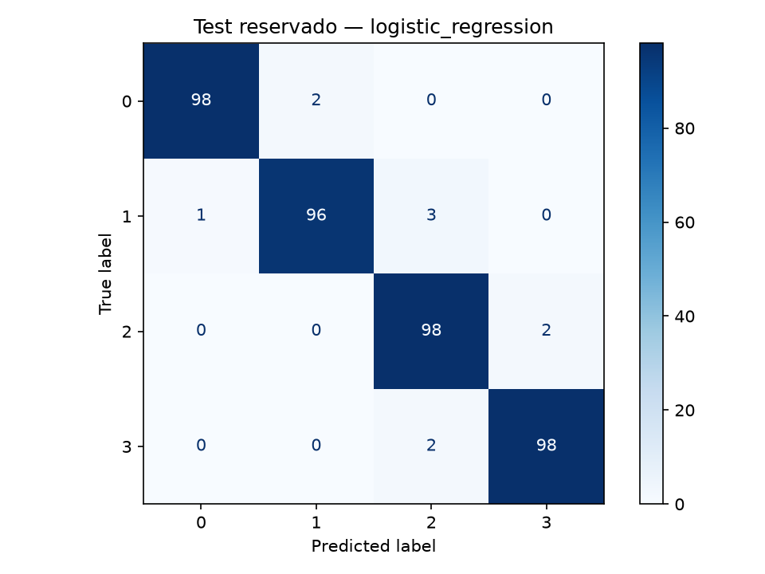

# Resultados del primer experimento

Ejecución: 6 de septiembre de 2026. Fuente y checksum en [dataset.md](dataset.md).
Los datos se leen por URL pública en memoria; no se almacena el CSV en el proyecto.

## Comparación justa

En el EDA del entrenamiento, Spearman con la gama fue 0.918 para RAM, 0.200 para
batería, 0.160 para ancho en píxeles y 0.117 para alto en píxeles. La RAM presenta
la asociación monotónica más fuerte; estas cifras no establecen causalidad ni costos.

Se evaluaron 12 configuraciones con 5 folds estratificados sobre las mismas 1.600
filas de entrenamiento. Se eligió el máximo F1 macro medio; no se compararon candidatos
con el test. La tabla muestra la mejor configuración de cada familia.

| Modelo | F1 macro CV | Desviación entre folds | Accuracy CV |
|---|---:|---:|---:|
| Regresión logística | 0.9630 | 0.0092 | 0.9631 |
| XGBoost | 0.9049 | 0.0176 | 0.9050 |
| Random Forest | 0.8737 | 0.0328 | 0.8744 |
| SVM RBF | 0.8585 | 0.0096 | 0.8575 |
| Dummy (clase más frecuente) | 0.1000 | 0.0000 | 0.2500 |

La regresión logística con C=10 y StandardScaler ganó dentro de esta búsqueda pequeña.
Esto no prueba que supere a todas las posibles configuraciones de los otros algoritmos.
Random Forest y XGBoost alcanzaron F1=1 en los folds de entrenamiento, pero bastante
menos en validación: una señal de sobreajuste. La complejidad por sí sola no garantiza
mejor generalización. La desviación entre folds no es un intervalo de confianza.

## Evaluación final del ganador

Se reajustó el pipeline ganador con las 1.600 filas de entrenamiento y se evaluó en
400 filas reservadas, 100 por clase. No se volvió a ajustar a partir de estos errores.

- Accuracy: **97.5 %**, es decir, **390 aciertos de 400**.
- F1 macro: **0.9750**.
- Recall por gama 0/1/2/3: **0.98 / 0.96 / 0.98 / 0.98**.
- Error absoluto medio entre códigos: **0.025**.
- Kappa cuadrático: **0.9900**.
- Errores de dos o más gamas: **0 de 400** en esta partición.

Los diez errores fueron entre gamas vecinas. Se cumplieron las metas académicas
propuestas (F1 macro >= 0.90 y recall por clase >= 0.85). Se registró el pipeline como
`mobile-price-classifier`, versión local 1, con alias `champion` en MLflow.

## Evidencia y reproducción

Verificación local: 10 pruebas unitarias aprobadas, Ruff sin errores y los tres
notebooks ejecutados de principio a fin. Se comprobó la recuperación del pipeline
desde el alias champion de MLflow y la ausencia de archivos CSV en data/.

- [Tabla de comparación](results/leaderboard.csv).
- [Métricas, parámetros y versiones exactas](results/evaluation.json).
- [Índices de partición, sin registros del dataset](results/split_indices.json).
- Archivos `cv_*.csv`: puntuaciones por fold y configuración, no datos de celulares.
- [Notebook de experimentos](../notebooks/03_experiments.ipynb).
- Comando: `uv run python -m src.models.train` desde la raíz.

Las métricas no garantizan rendimiento con celulares actuales ni equivalen a acertar
precios en dinero. No hay prueba externa de mercado. Si se usan los errores de test para
decidir nuevas transformaciones o búsquedas, ese test deja de ser una evaluación final
independiente: será necesario otro conjunto o protocolo de evaluación.
